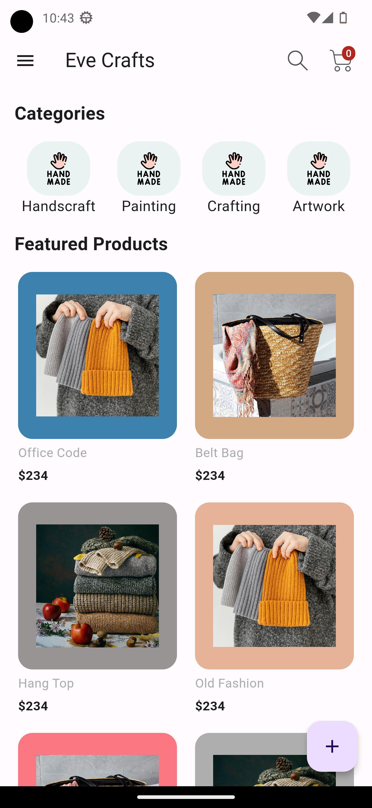
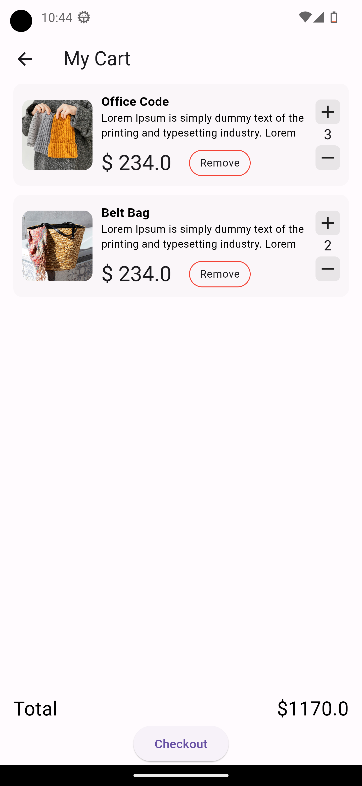
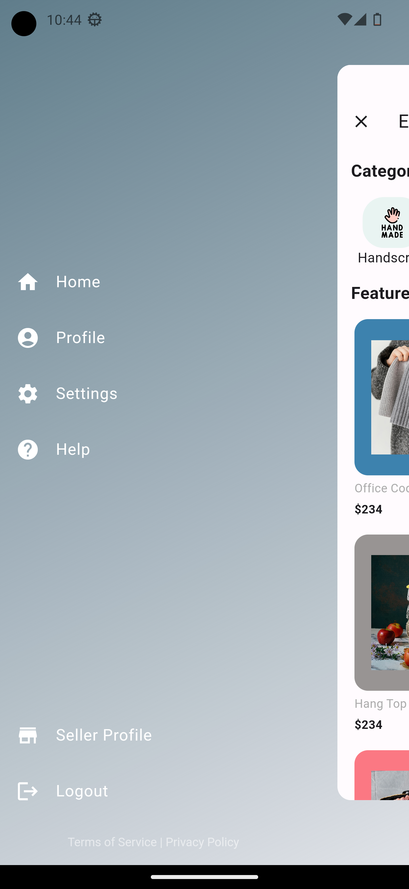

# Eve Crafts Marketplace

Welcome to Eve Crafts Marketplace, a mobile app for buying and selling handmade crafts, artwork, and hobby supplies. This README file provides an overview of the project, instructions for running the app locally, and other important information for developers and contributors.

## Overview

Eve Crafts Marketplace is a Flutter-based mobile app developed as part of a project to create an online marketplace for craft enthusiasts. The app allows users to browse, buy, and sell handmade items, connect with other users, and foster a vibrant community of artists and hobbyists.

## Features

- User authentication: Sign up and log in securely to access app features.
- Product browsing: Explore a wide range of handmade crafts, artwork, and hobby supplies.
- Shopping cart management: Add items to your cart, update quantities, and proceed to checkout.
- Responsive design: Enjoy a seamless user experience on various devices and screen sizes.

## Installation

To run the app locally, follow these steps:

1. Clone the repository to your local machine:
  git clone <https://github.com/Ammad-Naseer/eve_crafts.git>

2. Navigate to the project directory:
   cd eve_crafts

3. Install dependencies using Flutter:
   flutter pub get

4. Run the app on a simulator or physical device:
   flutter run

## Contributing

Contributions to Eve Crafts Marketplace are welcome! If you'd like to contribute to the project, please follow these steps:

1. Fork the repository.
2. Create a new branch for your feature or bug fix: `git checkout -b feature/my-feature`.
3. Make your changes and commit them: `git commit -m 'Add new feature'`.
4. Push to your forked repository: `git push origin feature/my-feature`.
5. Create a pull request for your changes.

## License

This project is licensed under the [MIT License](LICENSE).

## Contact

For questions or inquiries about Eve Crafts Marketplace, please contact Ammad Naseer at <ammad.naseer33@gmail.com>.

## Screenshots

|  |  |  |  |
| :-------------------------------------------------------: | :-------------------------------------------------------: | :--------------------------------------------------------: | :-------------------------------------------------------: |
| *Home Screen of Eve Crafts Marketplace with Featured Crafts* | *Cart page* | *Drawer Menu* | *Login Screen* |
